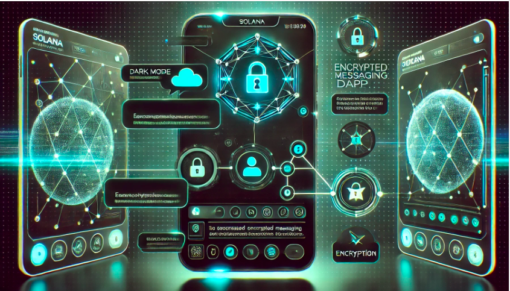


# Relay: A Decentralized Encrypted Messaging dApp

## Introduction

Welcome to Relay, a decentralized messaging dApp built on the Solana blockchain. In the era of Web3, our goal is to provide a secure and censorship-resistant platform for communication. With Relay, you can send encrypted messages without worrying about central authorities intercepting, leaking, or blocking your communication.

## Features

- **End-to-End Encryption**: Messages are encrypted using your private key and the recipient's public key. This ensures that only the intended recipient can decrypt and read the message.
- **Decentralization**: Hosted on the Solana blockchain, Relay eliminates the risk of central control or shutdown.
- **Privacy and Security**: No central authority can access or tamper with your messages.

## Use Cases

**Anonymous Communication**: Relay allows for secure and anonymous communication, protecting user identity.

**Resistant to Censorship**: Messages cannot be blocked or censored by any central authority.

**Data Integrity**: Ensures that the message data remains unchanged and secure.

# 

# Current Application Web design


## Landing Page


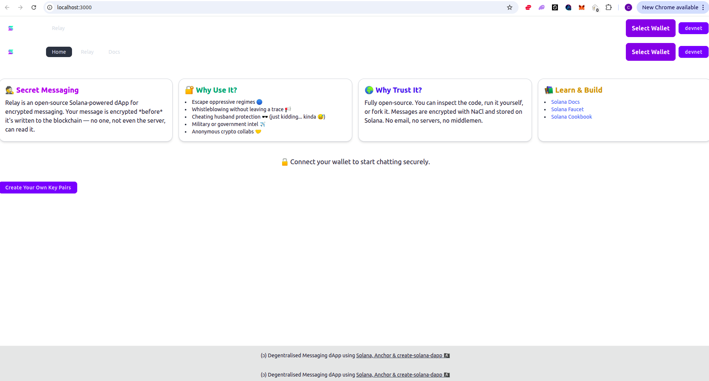


## Create Your Own Key Pairs

Clicking on "Create Your own Key Pairs" gives your own Public and Private keys. 

Each user must generate a keypair (public key + private key) using TweetNaCl. After generating their keys, both users exchange their **public keys** with each other.

> *Only public keys are shared. Private keys must remain secret.*


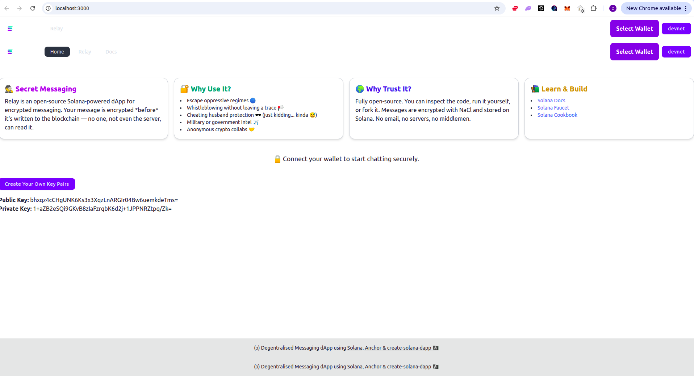


## Relay App

Click on relay to go to Chat app 

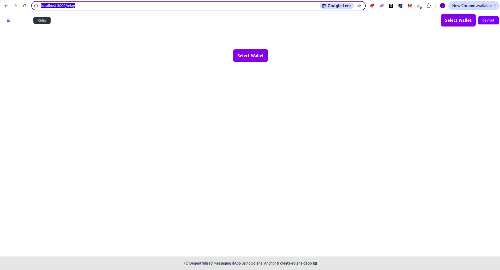


## Connect Wallet

Currently shows all messages on teh Smart contract but in future it can show only your messages. All encrypted messages will have a Decrypt button to decrypt.

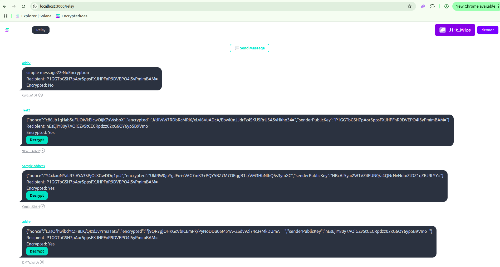


## Send Secret Message

Address - can be anything

Message - Secret message to encrypt

Recipient Public Key -  Other users public key with whom you want to message secretly.

Your private key - 

Your public Key


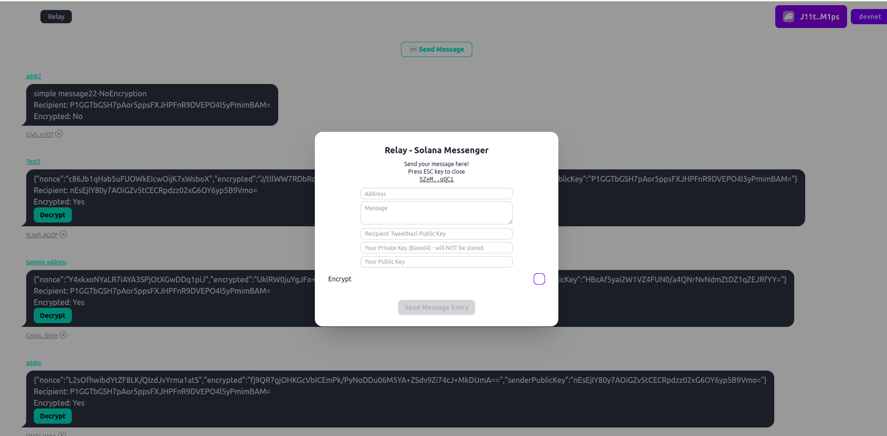


Example - 

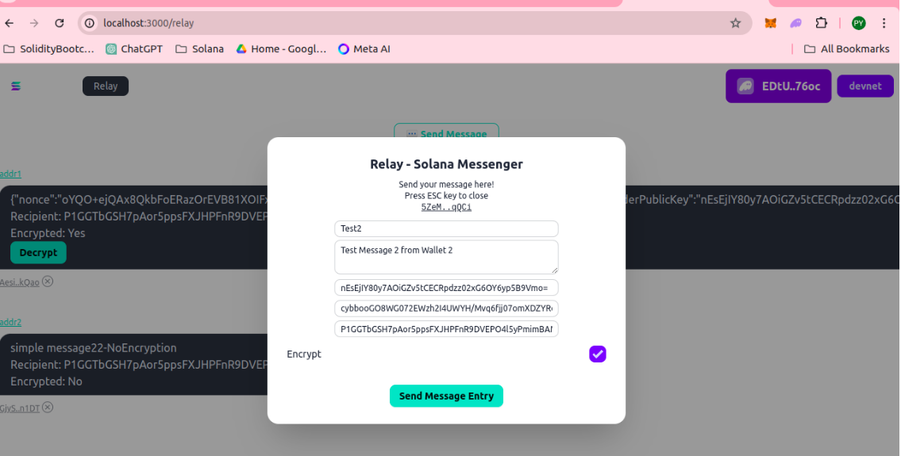


After submitting you see on the Chat relay;

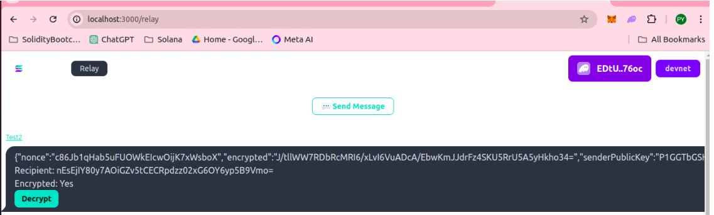


## Check Txn on Solana Blockchain Explorer

https://explorer.solana.com/address/5ZeMSd6ot2FPBBAt1s4hF3ffKAjNvp1LvFNT62FPqQCi?cluster=devnet

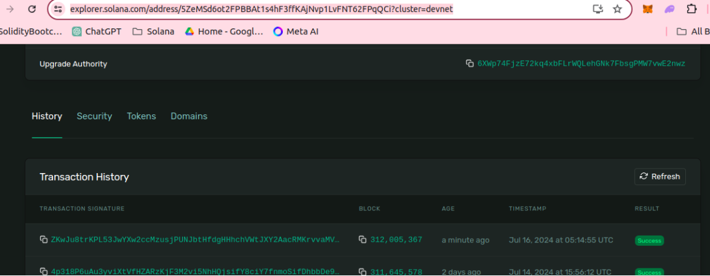


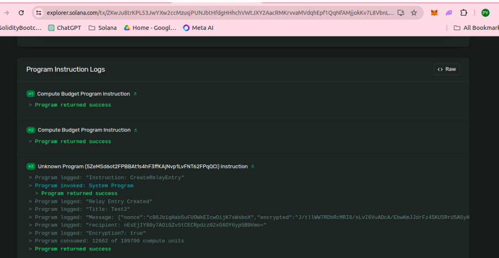


## Recipient Viewing the message


### Decrypt

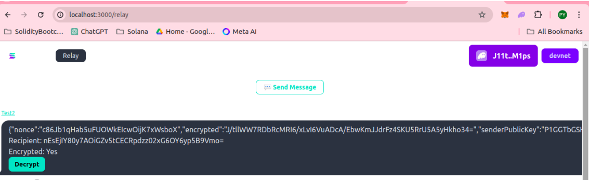


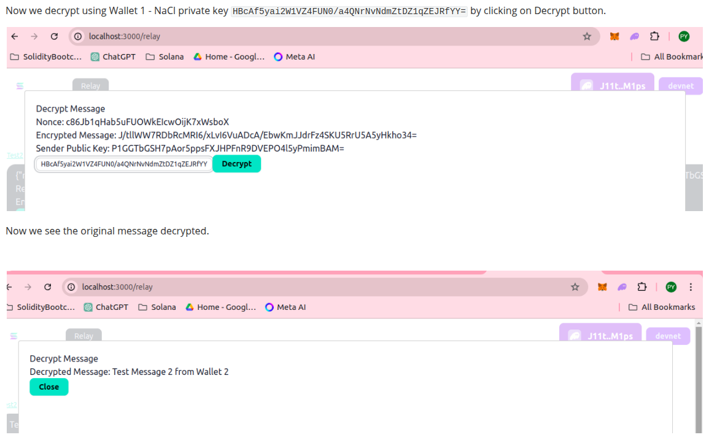


# Application Detail


## Technology Stack

- **Solana Blockchain**: Ensures decentralized hosting and high transaction throughput.
- **TweetNaCl**: Utilized for encrypting messages. It provides cryptographic functions to ensure data security.
- **Web3.js**: Used to connect to the Solana network and interact with smart contracts.
- **Phantom Wallet**: Integrated for managing user wallets and signing transactions.
- **Anchor Framework**: Simplifies Solana program development and deployment.

## Encryption Process

Relay uses TweetNaCl for encryption:

- **Encryption**: The sender's private key and the recipient's public key encrypt the message.
- **Decryption**: The recipient's private key and the sender's public key decrypt the message. This ensures that only the intended recipient can read the message, providing robust security.

## UI Architecture

Relay's front-end is built with React, leveraging various libraries for a seamless user experience:

- **React Query**: Manages data fetching and caching.
- **React Hot Toast**: Provides user notifications.
- **Solana Wallet Adapter**: Integrates Phantom Wallet for user authentication.
- **Tailwind CSS**: For styling components.

## Example Imports

```
javascriptCopy codeimport { useWallet } from '@solana/wallet-adapter-react';
import { LAMPORTS_PER_SOL, PublicKey } from '@solana/web3.js';
import { useQueryClient } from '@tanstack/react-query';
import { useConnection } from '@solana/wallet-adapter-react';
import { TOKEN_2022_PROGRAM_ID } from '@solana/spl-token';
import { Connection, SystemProgram, VersionedTransaction } from '@solana/web3.js';
import { useMutation, useQuery } from '@tanstack/react-query';
import toast from 'react-hot-toast';
import { useTransactionToast } from '../ui/ui-layout';
```

## Anchor and Smart Contracts

Relay uses the Anchor framework for Solana smart contract development. Here's a brief overview of our `lib.rs`:

```
rustCopy codeuse anchor_lang::prelude::*;

#[program]
pub mod relay {
    use super::*;
    pub fn send_message(ctx: Context<SendMessage>, message: String) -> ProgramResult {
        let message_account = &mut ctx.accounts.message_account;
        message_account.message = message;
        Ok(())
    }
}

#[account]
pub struct MessageAccount {
    pub message: String,
}
```

## Deployment

Relay is hosted on Vercel and accessible at: [Relay dApp](https://relay-devnet-git-encrypt-grav3r-projects.vercel.app/relay)

## Conclusion

Relay provides a secure, decentralized platform for encrypted messaging, ensuring privacy and freedom from central control. Join us in embracing the Web3 revolution and enjoy secure communication with Relay.

